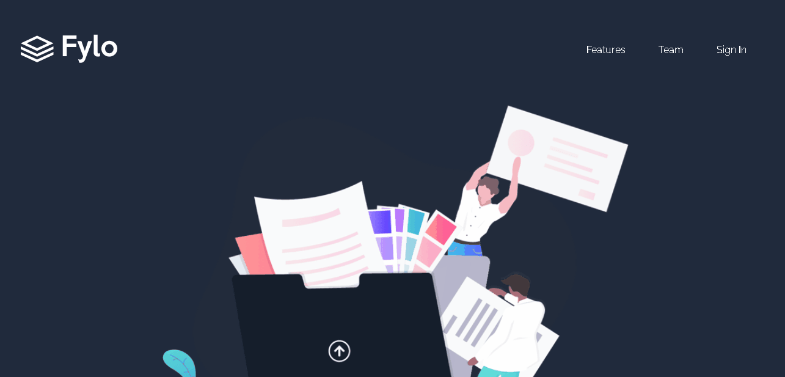

# Projeto Fylo
Desafio feito do Fontend Mentor de uma landing page projetada com Flex e Grid, e a utilização de javascript para validação de email.

## 🔗 Acesso ao projeto

## Desafios enfrentados
No começo parecia que ia ser fácil e rápido para fazer essa landig page, mas deu um pouco de trabalho, pois ela é um pouco extensa e tem bastante seções. A parte mais "trabalhosa" foi deixa os elementos posicionados corretamente.\
Tire bastante aprendizado desse desafio, pois tive que pesquisar algumas coisas que não sabia e, relembrar algumas skills que estavam enferrujadas também.

## 🛠 Skils

 
  
  
  

## 📤 Feedback
Se você tiver algum feedback, entre em contato comigo em jhony00._@hotmail.com
